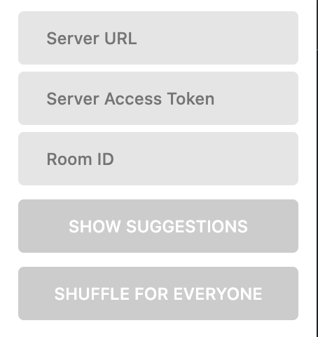
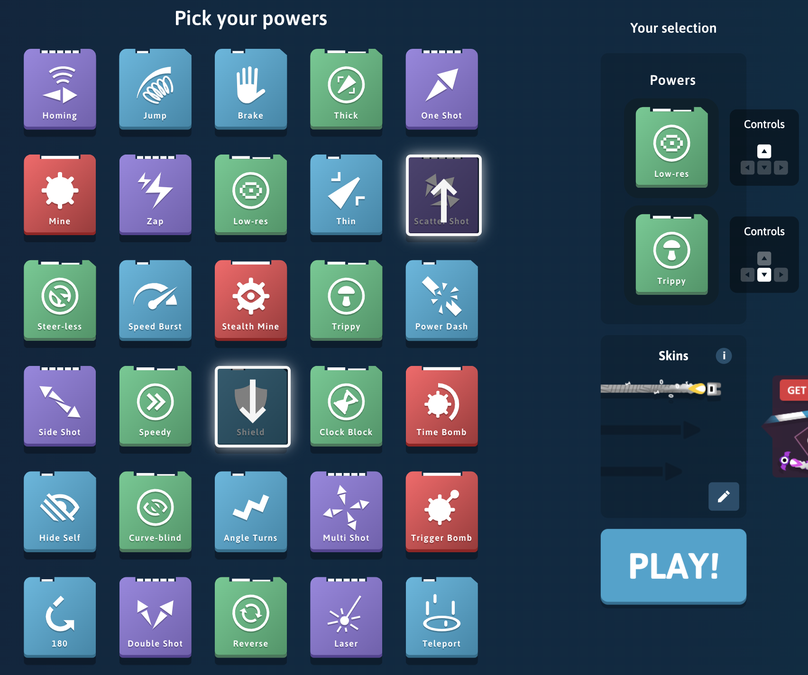

# cf-plus

Centrally distributed randomization for [Curve Fever](https://curvefever.pro) inventory.

After about half a year of experience in Curve Fever [Misu](https://github.com/SzNagyMisu) found that there are powerUps that we rarely or never use. Also there are some who have grown so expert in using a couple of powerUps that it seemed only fair to ask for a randomized game. Something like ARAM in League of Legends.

This project consists of a browser extension and a server. 

## Extension

The extension extracts `username` and `numOfPowerUps` from the UI and automatically registers a user with the `roomId` coming from the config. Then it periodically pulls the generated random powerUp suggestions for that user and highlights them.
It also has a button to send a request to the server to regenerate all the suggestions for users with the same `roomId`.

Tested in Chrome and Edge.

|   |  |
| -------------------------------------------- | --------------------------------------------- |
| Pops up when clicking on the extension icon. | Example config                                |

## Server

The server provides a simple REST API for user management and powerUp suggestions. It's backed by [Redis](https://redis.io) for fast permanent storage and based on [Deno](https://deno.land) for low latency.

Optionally a server access token can be set to keep out unknown users. If that's enabled then an `X-Access-Token` header will be required for every request.

Config can be passed via environment variables:
* `CFP_REDIS_HOST`
* `CFP_REDIS_PORT`
* `CFP_REDIS_USERNAME`
* `CFP_REDIS_PASSWORD`
* `CFP_SERVER_ACCESS_TOKEN` (optional)

Tested with [Deno Deploy](https://deno.com/deploy)

## Code

The code has been moved into two separate repos:
* [Browser Extension](https://github.com/schwarzkopfb/cf-plus-browser-extension)
* [Server](https://github.com/schwarzkopfb/cf-plus-server)

## Motivation

It was a weekend side-project to 
* experiment with [Deno](https://deno.land) + [Redis](https://redis.io),
* start exploring [Manifest v3](https://developer.chrome.com/docs/extensions/mv3/intro/) and
* practice browser extension development in [TypeScript](https://www.typescriptlang.org/).

## License

[MIT](LICENSE)
